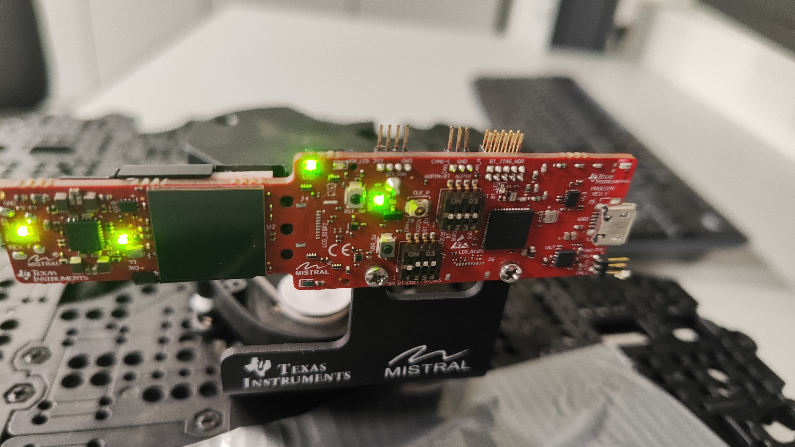
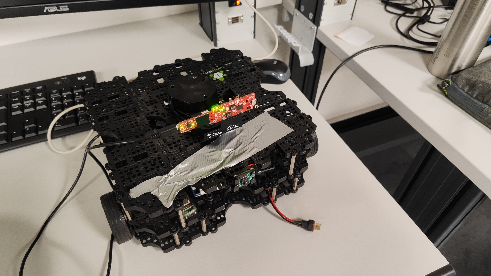
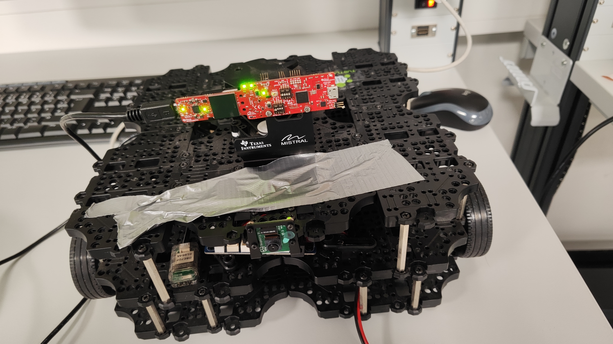

# mmwave-ti-ros

## Setup & Installation

[Follow OLD README](OLD_README.md)

## Sensor Attached on TB3

| TI mmwave sensor | TI mmwave on TB3 | TB3 with mmWave Sensor |
|---------|---------|---------|
|  |  |  |

## Docker image for RPi
- [Docker Image for TI mmWave on TB3](https://hub.docker.com/repository/docker/sachinkum0009/ros2-k3s)

## Building the Package

```bash
colcon build --symlink-install --packages-select radar2scan --cmake-args -DCMAKE_BUILD_TYPE=Release -DENABLE_CUDA=ON
```

### Customizing Parameters

Edit `config/radar2scan_params.yaml` or create your own configuration file:

```yaml
radar_processor:
  ros__parameters:
    # Angle range for the laser scan (in radians)
    # 180 degrees frontal view: from -90° to +90°
    angle_min: -1.5708  # -90 degrees (-π/2)
    angle_max: 1.5708   # +90 degrees (+π/2)
    
    # Angular resolution (in radians)
    # For exactly 61 rays with ceil() calculation:
    # We need: ceil((angle_max - angle_min) / angle_increment) = 61
    # Setting slightly smaller increment: 3.1416 / 60.5 ≈ 0.0519 rad ≈ 2.97 degrees
    angle_increment: 0.0519
    
    # Range limits (in meters)
    range_min: 0.1   # Minimum detection range
    range_max: 10.0  # Maximum detection range
    
    # Frame ID for the laser scan
    # Should match your TF tree configuration
    frame_id: "ti_mmwave_0"
    
    # Intensity filtering
    # Enable this to publish only high intensity points
    enable_intensity_filter: true   # Set to true to filter by intensity
    intensity_threshold: 20.0       # Minimum intensity value to keep (adjust based on your sensor)
    
    # GPU Acceleration (CUDA support enabled!)
    # Use CUDA GPU for processing to minimize CPU usage
    # Falls back to optimized CPU (OpenMP) if GPU is not available
    use_cuda: true  # Set to false to force CPU processing

```

## Commands

```bash
ros2 launch ti_mmwave_rospkg IWR6843.py cfg_file:=6843AOP_Standard.cfg rviz:=false

ros2 launch radar2scan radar2scan.launch.py
```

## Commands for TB3 with mmWave Sensor

```bash
ros2 run rmw_zenoh_cpp rmw_zenohd

ros2 launch turtlebot3_bringup robot.launch.py

ros2 launch ti_mmwave_rospkg IWR6843.py cfg_file:=6843AOP_Standard.cfg rviz:=false

ros2 run turtlebot3_teleop teleop_keyboard
```

## Original Repo
- https://git.ti.com/git/mmwave_radar/mmwave_ti_ros.git
